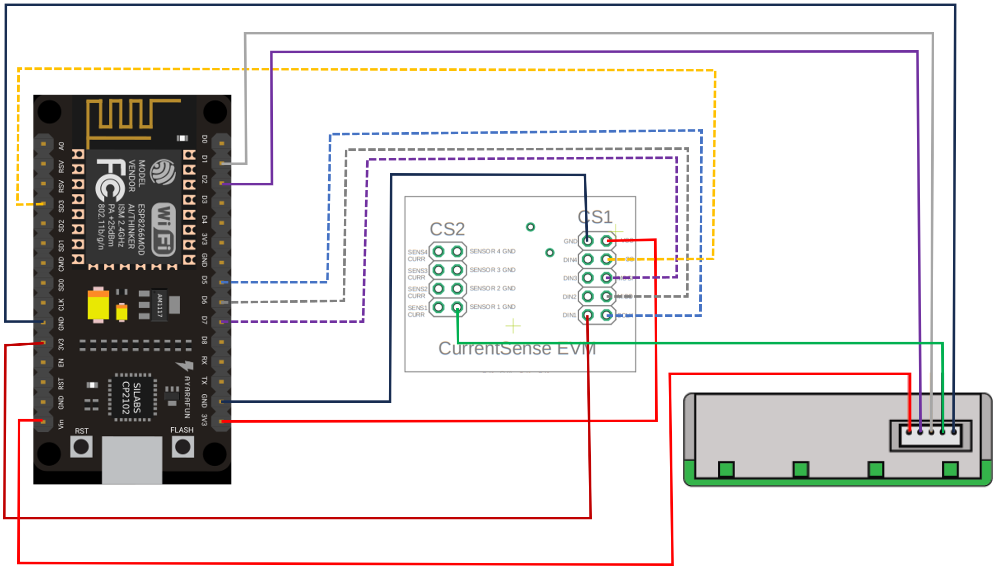

# Getting Started with Verified Telemetry on Arduino

## Table of Contents

* [Verified Telemetry Overview](#verified-telemetry-overview)
* [Links to board specific Device Samples](#sample-setup)
* [Analog and Digital Sensors configuration guide for Verified Telemetry.](#sensor-configuration)
* [Verified Telemetry Concepts](#calibration-and-testing)
* [Compatibility with other Arduino based boards](#compatibility-with-other-boards)

## Verified Telemetry Overview

Verified Telemetry (VT) is a state-of-the-art solution to determine the health of the sensor, i.e., working or faulty, which is consequently used to determine the quality of the sensed data. This is achieved by devising an intelligent “sensor fingerprint”, a set of unique electrical characteristics that differs between working and faulty sensors. The fingerprints can detect faults for a wide variety of off-the-shelf sensors and can be easily implemented with lightweight software code running on the Embedded device.

### Verified Telemetry Concepts

A few key concepts of VT are introduced and discussed below:

1. Sensor Fingerprint
    * Sensor fingerprint is an electrical characteristic that is measured by the Embedded device for a particular sensor
    * The Sensor fingerprint of a working sensor differs from that of a sensor with fault

1. Sensor Fingerprint Template
    * Sensor fingerprint template is a fingerprint of a working sensor
    * The fingerprint template is collected by the Embedded device, ideally when the sensor is provisioned first and stored locally on device.

1. Sensor Fingerprint Collection
    * Sensor Fingerprint Collection is a process where the Embedded device measures the fingerprint of a sensor
    * In the device samples, sensor fingerprint is collected at the same frequency at which telemetry is sent by the Embedded device

1. Sensor Fingerprint Evaluation
    * A sensor fingerprint that is collected is then compared with the stored sensor fingerprint template
    * If the collected fingerprint matches with the sensor fingerprint template, the sensor is classified as WORKING, otherwise FAULTY

1. Telemetry Status
    * The telemetry status of the telemetry that is generated by the sensor is tagged "true" if the sensor is working and "false" if the sensor has a fault
    * The telemetry status for each telemetry that supports Verified Telemetry is sent in every loop interval.

1. Fingerprint Template Synchronization at Boot
    * If the sensor fingerprint template exists in the non-volatile memory of the device, it is fetched and updated on the device when the device boots/resets. This ensures fingerprint template is collected only once when device is provisioned
    * If the sensor fingerprint template does not exist in the non-volatile memory of the device, like on first boot, fingerprint collection is done automatically and fingerprint template is stored in the non-volatile memory on device 

| |Description|
|-|-|
|[Verified Telemetry SDK](/Verified-Telemetry) |The SDK which builds on the Arduino middleware and describes how to integrate VT into existing device code. |
|[Verified Telemetry Device Sample](https://github.com/Azure-Samples/Verified-Telemetry-Arduino-Sample) |These Getting Started guides shows device developers how to combine Verified Telemetry with existing Arduino code. |

## Sample Setup

This device sample shows developers how to get started with Verified Telementry for Arduino and how to include Verified Telemetry with your existing Arduino code. This guide is for the ESP8266 based NodeMcu development board, however this sample can also be used to setup other arduino based developement board with minor changes descirbed in [Support for other Arduino compatible boards](#compatibility-with-other-boards-and-possible-additions)

### Prerequisites

1. ESPRESSIF ESP8266 based NodeMcu board or similar.
    
    The sample is configured to work with ESP8266 based board like the [NodeMcu](https://www.nodemcu.com/index_en.html)

2. Arduino IDE with ESP8266 board support.

    Install the [ESP8266 board support for Arduino](http://arduino.esp8266.com/Arduino/versions/2.0.0/doc/installing.html).

3. Verified Telemetry for Arduino.


    Clone the following repo to download the sample device code, VT Library, and offline versions of the documentation.

  
    ```shell
    git clone https://github.com/Azure-Samples/Verified-Telemetry-Arduino-Sample.git --recursive
    ```
4. CurrentSense Hat module.
   
    For digital sensor the VT Library utilizes the fingerprint extracted from the current profile of a sensor, to add current mesurement capability to the MCU an additional module, The [CurrentSense Hat](https://github.com/Azure/Verified-Telemetry/tree/main/Hardware/CS%20Hat) is required. 


3. Hardware

    > * ESP8266 NodeMcu Board.
    > * USB 2.0 A male to Micro USB male cable
    > * 1 * SPS30 Sensor(Digital Sensor)
    > * CurrentSense Hat module

### Library Initialization 

* the cloned repository has the [Verified Telemetry Library](/Verified-Telemetry) folder, this folder needs to be copied into the libraries folder in the Arduino user files, typically in  ``` C:\Users\VTUser\Documents\Arduino\libraries\Verified-Telemetry ``` for windows.

## Sensor Type and Configuration

### General Overview

* Verified Telemetry for Arduino sample currently supports **Digital Sensors**, support for **Analog sensors** can be added by making additional changes for which the user can refer [Verified Telemetry SDK](https://github.com/Azure/Verified-Telemetry) and [Verified Telemetry FreeRTOS Sample](https://github.com/Azure-Samples/Verified-Telemetry-FreeRTOS-Sample).
* Verified Telemetry Arduino Sample has support for multiple digital sensors, minimal changes are required to [sample_freertos_verified_telemetry_init.c](sample_freertos_verified_telemetry_init.c) file which are described below.


> **Note**    
> We recommend making connections for all the sensors before running the sample for the first time so that the autocalibration cycle can work seemleesly, if the sensors are connected after the sample is run for the first time, manual fingerprint collection is required, detail in [Manual Fingerprint Collection](#sensor-configuration-and-calibration)


### Sample configuration for Digital Sensors

* the sample is configured for 2 Digital sensors, use the below schematic and connection table to test out VT Arudino sample.
* To modify preexisting Hardware Definitions or to add support for new sensors, minimal changes are required to [sample_freertos_verified_telemetry_init.c](sample_freertos_verified_telemetry_init.c) for these changes, refer [Modifying ADC, GPIO, Hardware Definitions of sample and new sensors](#modifying-adc-gpio-hardware-definitions-of-sample-and-new-sensors).
* Some sensor also require the sensor read fucntion to be called right before the fingerprint collection, for this reason we recommend you to call all the sensor read fucntion as shown in [Integrating New Sensors](#steps-to-integrate-new-sensor-read-fucntions) section, to avoid any unexpected behaviour.


* ESP8266 Connections 

    


    * ESP8266 <-> CS Hat Connections

    | CS Hat Pin          | NodeMcu Pin | MCU Pin |
    |---------------------|-----------------------------|------------|
    | VCC  |        3V3                   | 3V3(3.3v)                    |
    | GND  |        GND                   | GND                    |
    | SCLK  |        D5                   | GPIO14(SCLK)                    |
    | MISO  |        D6                   | GPIO12(MISO)                    |
    | MOSI  |        D7                   | GPIO13(MOSI)                    |
    | CS  |        SD3                   | GPIO10(SDD3)                    |
    | DIN1  |        3V3                   | 3V3(3.3v)                    |

    * ESP8266 <-> Sensor <-> CS Hat Connections
    
    | Sensor Name   | Sensor Pin           | NodeMcu/CS Hat Pin | MCU Pin |
    |---------------|----------------------|-----------------------------|------------|
    | Senserion SPS30 | VDD (PIN 1)   |        NodeMcu Vin                   | ESp8266 Vin(5v)                    |
    | Senserion SPS30 | SDA/RX (PIN 2)           | NodeMcu D2                           |  ESp8266 GPIO4(SDA)                  |
    | Senserion SPS30 | SCL/TX (PIN 3)           | NodeMcu D1                           | ESp8266 GPIO5(SCL)        |    
    | Senserion SPS30 | SEL (PIN 4)           | NodeMcu GND                           | ESp8266 GND        |    
    | Senserion SPS30 | GND (PIN 5)           | CS Hat, SENSOR 1 GND                          | CS Hat, SENSOR 1 GND     |    


### Sensor Configuration and Calibration

In Verified Telemetry, fingerprint collection is a key part of sensor reliablity where a reference fingerprint is collected and used to compare with run-time fingerprints

* To give a streamline setup experince, the VT Arduino sample collects a refernce fingerprint at **first boot**. for this reason we recommend you to make the sensor connections before running the sample for the first time.

* If the device has been booted once or re-calibration is required, commands for calibration can be sent on serial terminal for different sensors : ```resetDigitalSensorOne``` and ```resetDigitalSensorTwo```

### Uploading the sample and Expected Output

Open the sample in Arduino IDE, select the relevent ESP8266 board like NodeMCU 1.0 (ESP-12E Module) and port and upload the sample to the board. 

* For the first boot, the output should be similar to the below output, where the sample is collecting the reference fingerprint for the sensors and then continues to collect run-time fingerprints to evaluate the sensor reliablity.

```output
Calibrating for first boot
Sensor One Reset Command
calibrate for : vTPMSExternal1 
Sensor Two Reset Command
calibrate for : vTSampleSecondSensor 
[VT INFO] 	Computing Currentsense Collection Settings
 Calibration_Done_Count : 1 MultiCalibration_Count : 4 
[VT INFO] 	Computing Currentsense Collection Settings
 Calibration_Done_Count : 1 MultiCalibration_Count : 4 
{'SPS_status': 0,'SPS_Data': 5} 
{'Second_Sensor_Status': 0 ,'Dummy_Second_Sensor_Data': 3} 
[VT INFO] 	Computing Currentsense Collection Settings
 Calibration_Done_Count : 2 MultiCalibration_Count : 4 
[VT INFO] 	Computing Currentsense Collection Settings
 Calibration_Done_Count : 2 MultiCalibration_Count : 4 
{'SPS_status': 0,'SPS_Data': 5} 
{'Second_Sensor_Status': 0 ,'Dummy_Second_Sensor_Data': 5} 
[VT INFO] 	Computing Currentsense Collection Settings
 Calibration_Done_Count : 3 MultiCalibration_Count : 4 
[VT INFO] 	Computing Currentsense Collection Settings
 Calibration_Done_Count : 3 MultiCalibration_Count : 4 
{'SPS_status': 0,'SPS_Data': 5} 
{'Second_Sensor_Status': 0 ,'Dummy_Second_Sensor_Data': 3} 
[VT INFO] 	Computing Currentsense Collection Settings
 Calibration_Done_Count : 4 MultiCalibration_Count : 4 
[VT INFO] 	Computing Currentsense Collection Settings
 Calibration_Done_Count : 4 MultiCalibration_Count : 4 
{'SPS_status': 0,'SPS_Data': 4} 
{'Second_Sensor_Status': 0 ,'Dummy_Second_Sensor_Data': 4} 
 
 DB SAVED FOR: vTPMSExternal1 
 
 DB SAVED FOR: vTSampleSecondSensor 

{'SPS_status': 1,'SPS_Data': 4} 
{'Second_Sensor_Status': 1 ,'Dummy_Second_Sensor_Data': 2} 

{'SPS_status': 1,'SPS_Data': 4} 
{'Second_Sensor_Status': 1 ,'Dummy_Second_Sensor_Data': 8} 
```

* For the subsequent boots, if you require a re-calibration, you can send the commands for calibration on the serial terminal like : ```resetDigitalSensorOne``` and ```resetDigitalSensorTwo```. The output should be similar to the below output, where the sample is collecting the reference fingerprint for the sensors and then continues to collect run-time fingerprints to evaluate the sensor reliablity.

```output
Sensor One Reset Command
calibrate for : vTPMSExternal1 
[VT INFO] 	Computing Currentsense Collection Settings
 Calibration_Done_Count : 1 MultiCalibration_Count : 4 

{'SPS_status': 1,'SPS_Data': 5} 
{'Second_Sensor_Status': 1 ,'Dummy_Second_Sensor_Data': 2} 
[VT INFO] 	Computing Currentsense Collection Settings
 Calibration_Done_Count : 2 MultiCalibration_Count : 4 

{'SPS_status': 1,'SPS_Data': 5} 
{'Second_Sensor_Status': 0 ,'Dummy_Second_Sensor_Data': 7} 
[VT INFO] 	Computing Currentsense Collection Settings
 Calibration_Done_Count : 3 MultiCalibration_Count : 4 

{'SPS_status': 1,'SPS_Data': 5} 
{'Second_Sensor_Status': 0 ,'Dummy_Second_Sensor_Data': 3} 
[VT INFO] 	Computing Currentsense Collection Settings
 Calibration_Done_Count : 4 MultiCalibration_Count : 4 

{'SPS_status': 1,'SPS_Data': 4} 
{'Second_Sensor_Status': 0 ,'Dummy_Second_Sensor_Data': 7} 
 
 DB SAVED FOR: vTPMSExternal1 

{'SPS_status': 1,'SPS_Data': 5} 
{'Second_Sensor_Status': 0 ,'Dummy_Second_Sensor_Data': 9} 

{'SPS_status': 1,'SPS_Data': 5} 
{'Second_Sensor_Status': 0 ,'Dummy_Second_Sensor_Data': 3} 

{'SPS_status': 1,'SPS_Data': 5} 
{'Second_Sensor_Status': 0 ,'Dummy_Second_Sensor_Data': 7} 
```

### Modifying ADC, GPIO, Hardware Definitions of sample and new sensors
    
* Hardware Definitions are present in file sample_vt_device_driver.cpp and is externed in sample_vt_device_driver.h, for any new sensor or to modify current hardware, check the instruction below.

* for ESP32 
   
   * got to file [sample_vt_device_driver.c](/sample_vt_device_driver.c) and add/modify Hardware Definitions under ``` /* Sensor Hardware Definitions */ ```
   * got to file [sample_vt_device_driver.h](/sample_vt_device_driver.h) and extern any new/modified Hardware Definitions under ``` /* Sensor Hardware Declaration */ ```

### Adding new sensors to the sample 

* To add new sensors to the sample, the following changes are required in [sample_freertos_verified_telemetry_init.c](sample_freertos_verified_telemetry_init.c).

1. Add new VT_SENSOR_HANDLE & FreeRTOS_VT_OBJECT according to the type of sensor.

   * to add a Digital Sensor, add new VT_SENSOR_HANDLE & FreeRTOS_VT_OBJECT between lines 30 & 35 
         
            #if defined(BOTH_ANALOG_AND_DIGITAL_SENSORS) || defined(ONLY_DIGITAL_SENSORS)
                static FreeRTOS_VT_OBJECT sample_signature_sensor_1;
                static FreeRTOS_VT_OBJECT sample_signature_sensor_2;
                static FreeRTOS_VT_OBJECT sample_signature_sensor_N; // <- replace N with the number of the sensor
                static VT_SENSOR_HANDLE sample_handle_sensor_1;
                static VT_SENSOR_HANDLE sample_handle_sensor_2;
                static VT_SENSOR_HANDLE sample_handle_sensor_N;      // <- replace N with the number of the sensor
            #endif     
            
2. Call init function according to the type of sensor
       
      * to add an Digital Sensor, call vt_digital_sensor_signature_init() between lines 158 & 184 
         
       #if defined(BOTH_ANALOG_AND_DIGITAL_SENSORS) || defined(ONLY_DIGITAL_SENSORS)

           vt_digital_sensor_signature_init(&verified_telemetry_DB,
                                           &sample_signature_sensor_N,
                                           (UCHAR*)"newDigitalSensorN",
                                           true,
                                           vt_adc_id_sensor_N,
                                           (void*)&vt_adc_controller_sensor_N,
                                           (void*)&vt_adc_channel_sensor_N,
                                           CURRENTSENSE_EXTERNAL_ADC_REF_VOLT,
                                           CURRENTSENSE_EXTERNAL_ADC_RESOLUTION,
                                           (1.0f / (CURRENTSENSE_SHUNT_RESISTOR * CURRENTSENSE_OPAMP_GAIN)),
                                           &sample_handle_sensor_N);

       #endif

## Compatibility with other Arduino boards
The Verified Telemetry Arduino sample enables devices with Arduino compatibility to use Verified Telemetry, VT Arduino Sample comes with a fully functional fault detection SDK which can be easily combined and shipped with your own set of features like IoT integration and environment monitoring. 

Verified Telemetry Arduino sample is currently compatible with ESP8266 based boards, support for other boards can be added by making minimal changes for which users can refer the below steps.

### Steps to integrate MCP3204 library

To add support for other boards, the key change required is adding a MCP3204 ADC read library. 

1. Find a compatable MCP3204 library that is capable of reading ADC data from MCP3204, a compatable MCP3204 library can be found on the arduino library manager after selecting your board of choice. 

2. The new MCP library and it's corresponding read fucntions need to be added in [sample_vt_device_driver.c](/sample_vt_device_driver.c) file to read the MCP3204 ADC values. Start by adding the library header in the file and then creating an MCP Object as on line number  ```6    #include <MCP3XXX.h>``` and ```10    MCP3XXX_<10, 4, 312500> adc;``` respectively.

3. The final step is to use the MCP ADC read function as on line number ```127 adc_mcp3204_read_buffer_local[adc_mcp3204_read_buffer_datapoints_stored] = adc.analogRead(*((uint8_t*)adc_channel));``` which would return the ADC values from MCP3204 to the library.

> **Note**    
> If an off the shelf library is not available for your board, you can create a basic library with MCP3204 read capability and use it in the sample. the main requirement is that the library should be able to read the ADC values from MCP3204 and return the values as done on line number  
```127 ... adc.analogRead(*((uint8_t*)adc_channel));```.

### Steps to integrate new sensors
With new sensors, it is required to call the sensor read function just before the fingerprint collection starts, this is needed to capture the ***active*** region of the sensors current i.e. the state where the sensor is actively collecting sensor data, and all the sensing components are active. follow the steps below when adding new sensors.

1. The sensor read function can be defined in [sample_vt_device_driver.c](/sample_vt_device_driver.c) file, as can be seen on line number ``` 41 void sps_setup() ``` and ``` 58 int sps_loop() ``` for SPS sensor.

2. the sensor read fucntion, ```sps_loop()``` in this case, should be called just before the ```FreeRTOS_vt_signature_read()``` function is called, as can be seen on line number ``` 143 pm2_5 = sps_loop(); ```.

3. Finally, connect the ***DINx*** (x can be 1/2/3/4) pin of the CS Hat to HIGH (3.3v), this enables the input channel ***Sensor 1/2/3/4 Gnd*** on the CS Hat and enables read capabilities. Instead you can short the ***Sensor Global Control*** jumpers to enable all Sensor 1-4 Gnd pins.


## Support

If you need support, please see our [SUPPORT.md](./SUPPORT.md) file.

## Contributing

This project welcomes contributions and suggestions.  Most contributions require you to agree to a
Contributor License Agreement (CLA) declaring that you have the right to, and actually do, grant us
the rights to use your contribution. For details, visit https://cla.opensource.microsoft.com.

When you submit a pull request, a CLA bot will automatically determine whether you need to provide
a CLA and decorate the PR appropriately (e.g., status check, comment). Simply follow the instructions
provided by the bot. You will only need to do this once across all repos using our CLA.

This project has adopted the [Microsoft Open Source Code of Conduct](https://opensource.microsoft.com/codeofconduct/).
For more information see the [Code of Conduct FAQ](https://opensource.microsoft.com/codeofconduct/faq/) or
contact [opencode@microsoft.com](mailto:opencode@microsoft.com) with any additional questions or comments.

## License

The Azure Verified Telemetry Getting Started guides are licensed under the [MIT](./LICENSE.txt) license.